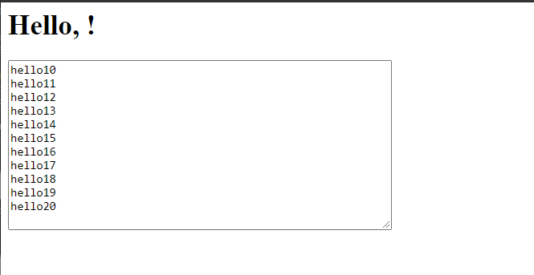

Overview:

This repo shows a demo for message transfer between html, flask server and interprocess python code.

Tutorial:

1. run pip3 install -r requirement.txt to install the requirement/
2. python3 run.py 
3. open your browser. visit port 5000.
